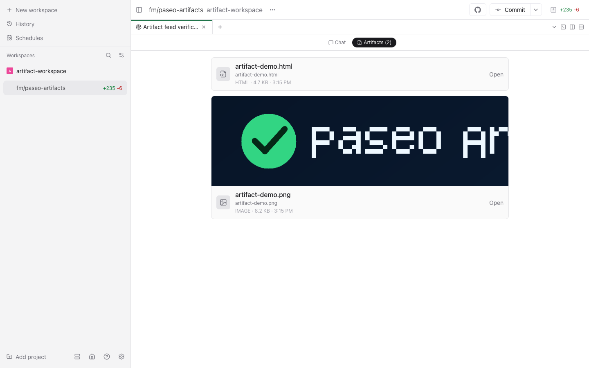

# Per-chat artifact feed

## Architecture findings

- The daemon owns agent lifecycle in `packages/server/src/server/agent/agent-manager.ts`. Each
  `ManagedAgent` has a stable Paseo agent id, provider session handle, workspace id, and working
  directory. Provider adapters normalize messages and tool calls into `AgentStreamEvent`; tool calls
  expose provider-neutral `write`, `edit`, and `shell` details.
- Agent metadata is persisted as one JSON record under `$PASEO_HOME/agents/` by
  `agent-storage.ts`. Conversation rows are separately persisted by the durable timeline store.
  `toStoredAgentRecord` and `toAgentPayload` are the boundaries between runtime state, disk state,
  and WebSocket snapshots.
- A foreground turn starts through `AgentManager.streamAgent()` and provider events are serialized
  through `enqueueSessionEvent()`. `turn_started` and the terminal events (`turn_completed`,
  `turn_failed`, `turn_canceled`) provide a provider-independent window around filesystem work.
- The wire contract lives in `packages/protocol/src/messages.ts`. Agent snapshots are additive Zod
  objects, so an optional artifact list is backward-readable by old clients. New feature UI must be
  gated by `server_info.features.*`.
- The app keeps normalized agent snapshots in `packages/app/src/stores/session-store.ts`. The chat
  surface is the registered agent panel in `packages/app/src/panels/agent-panel.tsx`; it already has
  the agent cwd, daemon client, and workspace-file opener needed by an artifact feed.
- File bytes are available through the existing `DaemonClient.readFile(cwd, path)` binary transfer.
  Existing attachment-preview storage can turn image bytes into cross-platform preview URLs.

## MVP design

- Watch an agent's cwd recursively for the duration of each turn and also accept normalized
  `write`/`edit` tool paths as a fallback. At the terminal event, stat supported files and merge them
  into a per-agent list keyed by relative path.
- Supported v0 types: HTML, Markdown, common raster images, SVG, PDF, and diff/patch files.
- Persist the list inside the existing agent JSON record and include it as an optional field on
  agent snapshots. Advertise a single `artifactFeed` server capability so a new client can explain
  an old daemon instead of inventing a fallback.
- Add Chat / Artifacts controls inside the agent panel. The artifact view is chronological, previews
  images through the existing file RPC, and opens any card in the normal workspace file pane.

## Running the fork

The verification run used isolated checkout-local state and two otherwise-free high ports. It did
not touch the installed `@getpaseo/cli` or the production daemon on port 6767.

```bash
# Terminal 1: daemon
PASEO_HOME="$PWD/.dev/artifact-feed-home" \
PASEO_LISTEN=127.0.0.1:8347 \
PASEO_DEV_MANAGED_HOME=1 \
PASEO_CORS_ORIGINS='*' \
npm run dev:server:raw

# Terminal 2: web app
PASEO_HOME="$PWD/.dev/artifact-feed-home" \
PASEO_LISTEN=127.0.0.1:8347 \
EXPO_PORT=9347 \
BROWSER=none \
./scripts/dev-app.sh
```

Use the checkout CLI with the same `PASEO_HOME` and `PASEO_LISTEN` values to create or inspect an
agent. Ports 8347 and 9347 were checked with `lsof` before this run; choose new free ports if either
is occupied.

### What was added

- `packages/server/src/server/agent/artifacts/collector.ts` owns turn-scoped detection and merging.
- Protocol agent snapshots carry an optional `artifacts` list, and the daemon advertises the
  `artifactFeed` capability.
- Existing agent storage persists artifact metadata, so feeds survive daemon restarts without a new
  data store or migration.
- `packages/app/src/artifacts/feed.tsx` is the isolated feed UI. `agent-panel.tsx` only supplies the
  Chat / Artifacts switch and existing file-pane callback.

## Verification evidence

A real Codex session (`45047311-988f-4ee7-84d5-094f43d375c4`) ran in an isolated registered
workspace and created `artifact-demo.html` plus a valid 800x450 `artifact-demo.png`. The terminal
event collected two artifacts, the agent JSON under `$PASEO_HOME/agents/` persisted both records,
and the isolated daemon was stopped and restarted. A fresh headless Chrome session then loaded both
persisted cards through the restarted daemon and fetched/rendered the PNG inline through the
existing file RPC.



## Known gaps

- Attribution is best-effort: a concurrent process modifying a supported file in the same cwd during
  an agent turn can be included. Files written outside the agent cwd are intentionally excluded.
- The closing scan is bounded to 20,000 directory entries and skips generated/vendor directories
  such as `.git`, `node_modules`, `.expo`, coverage, and build caches.
- The feed keeps one current card per path rather than revisions. Deleted artifacts remain as useful
  history metadata but can no longer be opened or previewed.
- HTML, Markdown, PDF, SVG, and diff artifacts open in Paseo's existing file pane. The MVP does not
  execute HTML in an iframe or add an OS-browser action.
- There is no pruning or virtualization yet; a very long-lived chat with thousands of unique
  artifact paths will grow its snapshot and feed.
